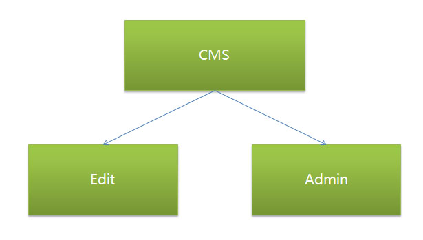

# CMS Needs Analysis  

## Introduction  

This content is about cms for chigix Team to develop APP store.

  

## Directory

### EDIT

* column  
* information  
* special information  
* collection  
* plug  

### ADMIN  

* user  
* member  
* all site search  
* online payment  
* back up  
* update 

## Content  

### EDIT

#### column  

**pageMode**

1.LIST

**add column**

>>root
>>>parent column
>>>>ultimate

>>root
>>>>child
>>>>>ultimate

>>root  
>>ultimate  

**site prospect**  

1. authority  
2. Audit  
3. publish article  
4. management myself  

#### information  

**add information**  

1. authority  
2. hits  
3. comment  
4. downloads
5. vote
* project
* type
* limit IP
* limit time

**management**

1. audit
2. repeat title

**special topic**

1. classification

**commit**

1. obtain IP
2. delete  

#### Collection
#### Plug

**advertising**
**vote**
**friend link**
**message board**
1. add
2. delete

### ADMIN  

* user
* member
* all site search
* online payment
* back up
* update

#### user

**add**

* department
* ban
* password
* group

**management**  

* add group

authority  

* add department

 **log**  

* login log
* operating log 

#### member  

 **search**
 **change member**

* name
* audit
* group
* surplus days
* points
* account balance

 **group**

* level
* MAX Downloads

 **blog**
 **recharge**
 **send email**
 **delete**
 **follower**
 **message**
